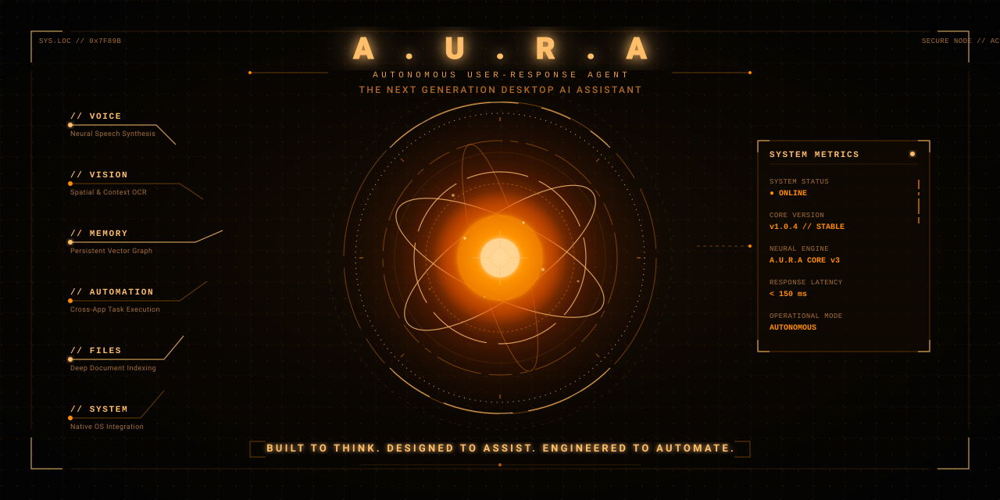

# A.U.R.A v2

### Autonomous User-Responsive Assistant



**A.U.R.A v2** is an AI-powered desktop assistant designed to make everyday computer interaction more natural, intelligent, and automated. It combines AI conversation, voice interaction, desktop automation, persistent memory, system controls, wake-up commands, offline voice synthesis, and a modular plugin architecture into a single assistant.

Built by **CodeCrafters**.

---

## Overview

A.U.R.A is designed to work alongside the user rather than functioning as a conventional chatbot. It can understand natural-language commands, interact with the desktop, perform supported system actions, remember information, research topics, process files, and respond through voice.

Version 2 introduces a more modular architecture together with configurable audio devices, customizable wake-up commands, and a dedicated plugin system.

---

## Features

| Feature | Description |
|---|---|
| **AI Voice Interaction** | Natural voice-based communication with the assistant. |
| **Wake-Up System** | Activate A.U.R.A using configurable wake commands. |
| **"Hey AURA"** | Natural voice activation command. |
| **"AURA, Wake Up"** | Dedicated wake-up command inspired by traditional cinematic AI assistants. |
| **"Wake Up, Daddy's Home"** | Custom wake-up command for activating A.U.R.A. . This will absolutely be loved by Tony Stark a.k.a Iron Man Fans |
| **Desktop Automation** | Execute supported desktop, keyboard, mouse, browser, and system actions. |
| **System Control** | Control supported system functions such as audio and other desktop operations. |
| **Persistent Memory** | Store and retrieve useful information across sessions. |
| **Hybrid Interaction** | Switch between voice and keyboard-based interaction. |
| **Custom Microphone** | Select the microphone used for voice input. |
| **Custom Speaker** | Select the speaker, headset, or other output device used by A.U.R.A. |
| **Plugin System** | Extend A.U.R.A with modular plugins without modifying the core architecture. |
| **File Processing** | Work with supported local files and AI-assisted processing workflows. |
| **Web Research** | Retrieve and process information through supported online capabilities. |
| **Browser Interaction** | Perform supported browser-based tasks and automation. |
| **Assistant Customization** | Configure assistant behavior, voice, devices, and other preferences. |
| **Modular Architecture** | Separate core logic, actions, memory, plugins, configuration, UI, and voice components. |
| **Face Unlock Feature** | If You Have camera, for more security, to authorize for you only in your computer, face recognision feature can help you with. |
| **Room Checking** | It always monitors your room using your camera with a preview you can see through a draggable preview box |

---

## What's New in v2

A.U.R.A v2 significantly expands the original architecture with:

- **Dedicated wake-up system**
- **"Hey AURA" activation**
- **"AURA, Wake Up" activation**
- **"DADDY's Home" custom command**
- **Individual microphone selection**
- **Individual speaker/output selection**
- **Modular plugin architecture**
- **Face Unlock Feature**
- **Room Checking Feature**
- Improved separation between core assistant components
- Expanded desktop automation and customization capabilities

The new voice and wake-up systems are designed to create a more natural, hands-free assistant experience inspired by traditional futuristic desktop assistants.

---

## Architecture

A.U.R.A v2 follows a modular Python architecture:

```text
A.U.R.A v2
│
├── actions/          # Desktop and system actions
├── config/           # Configuration and preferences
├── core/             # Core assistant and voice logic
├── dashboard/        # Dashboard components
├── memory/           # Persistent memory system
├── plugins/          # Plugin architecture
│
├── main.py           # Application entry point
├── ui.py             # User interface
├── setup.py          # Setup configuration
├── requirements.txt  # Python dependencies
└── .gitignore

```

This structure allows individual systems to be developed and maintained independently while keeping the main assistant modular and extensible.

## Voice & Wake-Up Pipeline:
```
Microphone
    ↓
Wake-Up Detection
    ↓
Voice Input
    ↓
AI Processing
    ↓
Action / Response
    ↓
Text Response
    ↓
Selected Speaker
```

A.U.R.A can therefore remain available for hands-free interaction while allowing the user to control which audio devices are used for input and output.

## Plugin Architecture:

The new plugins/ system allows A.U.R.A to be extended through independent modules.

Plugins can be used to introduce additional:

```
Automation capabilities
Integrations
Commands
Tools
Workflows
Assistant functions
```

This approach keeps optional functionality separate from the core assistant and provides a foundation for expanding the A.U.R.A ecosystem.

## Installation:

1. Clone the repository

```
git clone https://github.com/gitsdp-dev/A.U.R.A_v2-CodeCrafters.git
cd A.U.R.A_v2-CodeCrafters
```
2. Install dependencies

```
pip install -r requirements.txt
```

3. Run A.U.R.A

```
python main.py
```

or

```
py main.py
```

Additional configuration, API credentials, audio devices, or external dependencies may be required depending on the enabled features.

## Requirements:

| Requirement | Details |
|-------------|---------|
| Operating System | Windows (Recommended), macOS, Linux |
| Python | 3.11 or newer |
| Internet | Required for AI features |
| Microphone | Recommended |
| Gemini API Key | Free |

Note: A.U.R.A's offline voice system works locally, but features that depend on AI APIs, web research, or other online services still require an internet connection.

## Project Status:

A.U.R.A v2 is actively under development.

The architecture and features may continue to evolve as new automation capabilities, plugins, voice functionality, and integrations are introduced.


## Contributions are always welcomed. 

You can contribute through:

Bug fixes
New features
Plugin development
UI improvements
Voice-system improvements
Automation capabilities
Documentation
Testing
Performance improvements

For major changes, opening an issue before implementation is recommended.

### A Small Change Towards a Little Bit Innovation By CodeCrafters ❤️

A.U.R.A is developed by CodeCrafters, an independent development team focused on AI assistants, productivity software, developer tools, and experimental desktop applications.

GitHub:
https://github.com/gitsdp-dev

Instagram:
https://instagram.com/codecrafters_org_2011sdp

License

This project is licensed under the MIT License.

See the LICENSE file for details.

## A.U.R.A

### Autonomous User-Responsive Assistant

## Your Desktop. Smarter Than Ever.

### Built by CodeCrafters.


This version keeps the README **substantial enough to look like a serious GitHub project**, while avoiding the very long explanatory sections from the previous version.
